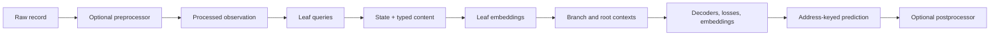

# Data Flow

**Example status — excerpt:** the record and schema blocks form a conceptual
walkthrough, not a training job.

A RelFlow schema sits in the middle of the complete modeling path. It tells the
input pipeline where values come from, tells tensorfields how to represent them,
and tells the model which contexts and predictions to build.

This page follows one record from raw input to public output. It introduces the
user-facing terms needed by the rest of the docs; architecture internals come
later in [Model Tree](model-tree.qmd#architecture-internals).



## One Record And One Schema

Consider an order used to predict whether it will be returned:

```{python .marimo}
#| echo: true
#| output: true

record = {
    "customer_tier": "gold",
    "line_items": [
        {"sku": "A12", "quantity": 2, "price": 19.99},
        {"sku": "B07", "quantity": 1, "price": 45.50},
    ],
    "returned": "false",
}
```

```{python .marimo}
#| echo: true
#| output: true

import relflow as rf

model = rf.Model(
    name="order",
    d_model=32,
    n_layers=1,
    n_heads=4,
    embed=True,
    customer_tier=rf.Category(size=16),
    line_items=rf.Branch(
        length=8,
        sku=rf.Category(size=2048),
        quantity=rf.Number,
        price=rf.Number,
    ),
    returned=rf.Category(target=True, size=2),
)
```

The schema has one root context, one repeated child context, five leaf fields,
and one target. The stable addresses include `order/customer_tier`,
`order/line_items/price`, and `order/returned`.

## 1. Normalize Raw Input When Necessary

Public convenience methods such as `model.predict(...)` accept a list of raw
dictionaries. A data module reads the same kind of records for training,
validation, testing, and batch prediction.

An optional `Preprocessor` runs before schema queries. Use one when selection is
not enough—for example, to coerce inconsistent types, sort events, apply an
`as_of` time window, derive elapsed time, or turn one source object into several
model observations.

The result is a **processed observation**: one model-facing mapping wrapped in
`rf.Observation`. A preprocessor may yield several observations from one raw
record, but each output is an independent example with its own singleton root.
Internally, RelFlow wraps each observation as a one-record list so inferred
queries can start with `[*]`; that list does not create multiple root items.

::: {.callout-important}
Use the same preprocessor contract for every data split and inference path.
Reimplementing normalization separately at serving time creates
training-serving skew even when the model weights are identical.
:::

## 2. Bind Leaves To Values

Only leaf tensorfields read values from the observation. Each leaf has a
JMESPath `query`:

| Address | Inferred query |
| --- | --- |
| `order/customer_tier` | `[*].customer_tier` |
| `order/line_items/sku` | `[*].line_items[*].sku` |
| `order/line_items/price` | `[*].line_items[*].price` |
| `order/returned` | `[*].returned` |

Field and branch names provide these defaults. The root name affects addresses,
not source lookup. Use [Binding Data](binding-data.qmd) to choose among an
inferred query, an explicit query, and preprocessing. Use
[Advanced Query Paths](querypaths.qmd) for filters, slices, and quoted keys.

## 3. Tensorfields Separate State From Content

A tensorfield converts query results into typed arrays. Every leaf keeps the
value's **state** separate from its **content**:

- state answers whether a position is valued, null, padded, masked, or in the
  reserved `other` state;
- content carries the datatype-specific payload, such as a normalized number,
  a category index, a multi-hot set, or a vector;
- trainability identifies positions whose hidden answer can contribute to
  loss;
- training targets retain original values that were hidden for reconstruction.

This separation matters. A padded line-item slot is not the numeric value zero,
and a masked category is not an ordinary category label. Datatypes can also
have their own unavailable-content behavior while retaining state `valued`.
The [Data Types value-state contract](data-types.qmd#value-state) is the
authoritative reference.

Use `model.encode(...)` when debugging this boundary:

```{python .marimo}
#| echo: true
#| output: true

encoded = model.encode([record])
print(encoded)
```

Most application code should not depend on these internal tensor layouts. They
are useful for checking that preprocessing and queries found the expected
values and shapes.

## 4. Visible Values Become Context

Each active, visible leaf embeds its state and content into `d_model`-wide
vectors. Sibling leaves under `line_items` share the same repeated coordinate:
the first SKU, quantity, and price describe the first item.

The `line_items` branch lets those item-level values interact, then pools the
child context into a representation for the order. The root combines that
representation with visible root fields such as `customer_tier`.

The tree therefore controls which values interact locally before information
flows upward. `Branch.length` bounds a repeated context; `overflow` decides
whether excess values keep the head, keep the tail, or raise an error.

## 5. Hidden Values Are Decoded

Training records include `returned`, but `target=True` keeps it out of visible
input and stores the original value as a trainable answer. Its decoder predicts
from the remaining order context. The tensorfield owns the target's loss and
metrics.

At prediction time the request should normally omit target fields:

```{python .marimo}
#| echo: true
#| output: true

request = {
    "customer_tier": "gold",
    "line_items": [
        {"sku": "A12", "quantity": 2, "price": 19.99},
        {"sku": "B07", "quantity": 1, "price": 45.50},
    ],
}
```

RelFlow creates the masked target position and decodes it. Other learning roles
use the same path: `p_mask` hides sampled positions, `p_prune` hides whole leaf
instances, and branch masking limits descendant sampling to candidate repeated
coordinates or windows. Descendant leaves sample independently inside those
candidates; a branch mask is not an atomic row mask. See
[Learning Modes & Embeddings](embeddings.qmd) for when to use each role.

## 6. Prediction Preserves Schema Addresses

`model.predict([request])` returns a dictionary keyed by address. In this
schema, configured outputs can include:

```text
order
`-- order/returned
```

The root entry contains the embedding requested by `embed=True`. The target
entry contains state probabilities, type-specific Category content, and an
`inferred` mask. `inferred=true` identifies positions decoded because their
input was masked; an embedding emitted for a visible leaf can have
`inferred=false`.

The address-keyed representation is the stable model output. An optional
`Postprocessor` can turn it into an API response or warehouse schema without
changing what the model predicts. Interactive prediction, the Parquet
`Writer`, and deployment helpers all use this schema-oriented output boundary.

## Training And Prediction Use The Same Path

The major difference between the two paths is what happens after encoding:

| Stage | Training / validation | Prediction |
| --- | --- | --- |
| Raw input and preprocessing | Read records for a named split | Read request or prediction records |
| Query and tensorization | Bind both context and available answers | Bind visible context; targets may be absent |
| Masking / pruning | Select trainable answers and retain targets | Create inference positions for configured targets or masks |
| Model tree | Encode visible context | Encode visible context |
| Decoder | Produce predictions used by losses and metrics | Produce public predictions |
| Output | Lightning metrics and optional callbacks | Address-keyed payload, writer, or postprocessor |

Keeping the schema, vocabulary/normalizer state, and weights in one saved
artifact—and versioning and deploying the processor code alongside it—is what
makes those paths comparable. Processor implementations are not serialized in
the model artifact. Validation still needs an honest split; shared mechanics do
not prevent data leakage.

## Progressive Glossary

| Term | Meaning |
| --- | --- |
| Schema | The serializable tree of model, branch, and tensorfield configuration. |
| Root | The singleton context representing one processed observation. Named `record` by default. |
| Branch | A bounded child context, usually corresponding to a repeated list of objects. |
| Leaf / tensorfield | A typed field that binds source values, tensorizes them, embeds visible input, and optionally decodes predictions. |
| Request | The configuration object created by `rf.Number`, `rf.Category(...)`, and the other leaf constructors. |
| Query | A JMESPath expression that selects one leaf's values from a processed observation. |
| Address | A stable slash-delimited location in the schema and prediction output. |
| State | The value condition at a position, separate from type-specific content. |
| Content | The datatype-specific representation or decoded value. |
| Context | The aligned vectors that may interact inside a root or branch. |
| Target | The original answer retained when a value is hidden for learning. |
| Embedding | A learned vector emitted internally between nodes or publicly when `embed=True`. |
| Preprocessor / postprocessor | Optional transformations immediately before query binding or after prediction writing. |

Terms such as *parcel* and *heritage* describe internal routing. They are useful
when extending the architecture, but they are not required to build and operate
a model through the public API.

## Where Next

- Read [Model Tree](model-tree.qmd) for branches, leaves, and addresses.
- Use [Built-In Data Types](data-types.qmd) for state/content semantics and
  field selection.
- Read [Binding Data](binding-data.qmd) before writing custom queries.
- Use [Data Modules](../guides/data-modules.qmd) for split ingestion and
  preprocessors.
- Use [Postprocessors](../guides/postprocessors.qmd) for application output.
