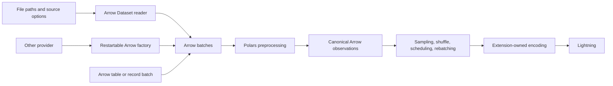

# Format-independent ArrowDataModule sources

Status: stage 1 implemented in the working tree; stage 2 remains proposed.
`rf.source(...)` and direct path/glob inputs are available. See the
[data module guide](../guides/data-modules.qmd) for current usage and limits.

Scope: simplify `../brands` and generalize the current uncommitted RelFlow data
changes. The proposal keeps `rf.ArrowDataModule` as the public training entry
point and Arrow as the CPU data representation.

## Decision

Accept files, directories, and file globs directly in `ArrowDataModule`. Add one
lazy `rf.source(...)` constructor for source options. Use PyArrow's existing
Dataset and FileFormat interfaces to read supported formats. Keep restartable
Arrow factories as the integration boundary for other readers.

Users describe where observations come from and how to prepare them. RelFlow
owns reopening sources, batching, worker lifecycle, distributed scheduling,
shuffling, and tensor encoding. Applications should not implement a data module
or a worker dataset to change storage formats.

“Plug and play” means supported formats work without application loader code,
and another Arrow-producing reader can use the same training pipeline. It does
not mean every file extension has a built-in parser, every source supports
parallel reads, or different formats automatically produce equivalent features.

## What the original changes solved

The inspected Brands implementation contains:

| Application code | Responsibility | Proposed owner |
| --- | --- | --- |
| `brands/data.py`, 241 lines | `PinnedEncoded`, `WorkerArrowDataset`, `WorkerArrowDataModule` | RelFlow's existing encoded batch and Arrow data module |
| `ParquetShardSource` and `parquet_split` in `brands/experiment.py` | Lazy S3 discovery, split matching, dataset caching, fresh readers | Generic RelFlow file source backed by Arrow |
| `build_datamodule` in `brands/experiment.py` | Split selection and experiment settings | Brands |
| `prepare_brands` in `brands/preprocessing.py` | Carrier, FBC, country, and region features | Brands |

The initial working diff added worker support, persistent epochs, prefetching,
pinned encoded batches, and schema serialization that drops derived selector
closures. Those changes address the reason for Brands' custom data module.

The earlier `rf.parquet` helper also absorbed shard discovery, but introduced
`ParquetSource` and `PartitionedSource` into the shared loader module. Its source
partitioning required `epoch_size` when multiple consumers were active,
required divisibility by `batch_size * ranks * workers`, and allocated an exact
row quota to each consumer. Unequal row groups or sampling can exhaust one
consumer even when enough rows exist elsewhere. It also materializes that
consumer's selected epoch with `list(limit(...))` before yielding batches.

Stage 1 replaces that helper and execution branch with the generic source. It
also adds serialization for decorated processors used by spawned workers,
explicit closing of Arrow readers/generators, and vocabulary proposal merging
for multiple workers in a single training rank. File identity checks use Arrow's
size and modification-time metadata; immutable storage is still required where
that metadata cannot reliably detect replacements.

Replacing `parquet_split` with `rf.parquet` removes application code, but does
not establish the format-independent source boundary or general scheduling
contract needed for the intended experience.

## User experience

### Small datasets

Proposed usage, assuming these files contain the fields in the model:

```python
import relflow as rf

model = rf.Model(
    d_model=32,
    n_layers=1,
    n_heads=4,
    amount=rf.Number,
    label=rf.Category(mask=True, size=2),
)

data = rf.ArrowDataModule(
    model=model,
    train="data/train.parquet",
    validate="data/validate.jsonl",
)
```

Each split resolves independently. A training split can use Parquet while
validation uses JSON Lines, provided both produce the observations the model
expects. Existing Arrow tables, record batches, and restartable Datasets remain
valid inputs. `PolarsDataModule` remains the existing eager Polars ingress;
changing every ingress API is outside this proposal.

### Brands after migration

This replaces the current `build_datamodule` using its existing constants and
`prepare_brands` import. It preserves the exact five-digit shard regexes in
`SPLITS` and the current sampling and epoch-size settings:

```python
def build_datamodule(model: rf.Model, root: str = DATA_ROOT) -> rf.ArrowDataModule:
    return rf.ArrowDataModule(
        model=model,
        train=rf.source(root, match=SPLITS["train"]),
        validate=rf.source(root, match=SPLITS["validate"]),
        test=rf.source(root, match=SPLITS["test"]),
        preprocessor=prepare_brands,
        seed=42,
        shuffle={"train": True, "validate": True, "test": False},
        sample=SAMPLE_RATE,
        epoch_size=EPOCH_SIZE,
        shuffle_rows=128_000,
        drop_last={"train": True, "validate": False, "test": False},
        num_workers=WORKERS_PER_RANK,
        persistent_workers=True,
        pin_memory=True,
    )
```

For projects that do not need the exact filename constraint, the three source
arguments can instead be plain strings:

```python
train = "s3://bucket/brands/train-*.parquet"
validate = "s3://bucket/brands/validation-*.parquet"
test = "s3://bucket/brands/test-*.parquet"
```

Switching storage to CSV changes those source descriptions to `*.csv`; it does
not change the data module or training loop. CSV parser options may be needed
to preserve string codes or null semantics. `prepare_brands` continues deriving
the nested model fields from the parsed source columns.

Brands retains `EPOCH_SIZE`: it expresses the intended experiment budget.
With batch size 2,000 and four ranks, the current global limits of 256,000,
64,000, and 128,000 rows give 32, 8, and 16 batches per rank respectively.
Worker count should be an execution setting, independent of those budgets.

### Explicit source options

Ordinary paths need no wrapper. Use `rf.source` when a source needs a declared
format, parsing options, schema, partition discovery, or custom filesystem:

```python
import pyarrow as pa
import pyarrow.csv as csv
import pyarrow.dataset as ds

train = rf.source(
    "data/train-*.csv",
    format=ds.CsvFileFormat(
        parse_options=csv.ParseOptions(delimiter=";"),
        convert_options=csv.ConvertOptions(column_types={"brand": pa.string()}),
    ),
)

partitioned = rf.source(
    "s3://bucket/events/",
    format="parquet",
    partitioning="hive",
)
```

Arrow owns parsing options. RelFlow should not invent parallel `csv_options`,
`json_options`, or format-specific configuration classes.

### Other data providers

Keep the existing factory contract: a zero-argument callable returns a fresh
Arrow reader or iterable of Arrow tables/record batches on every invocation.
For example, an Arrow IPC **stream** can use this existing API:

```python
import pyarrow as pa
import pyarrow.ipc as ipc
import relflow as rf

def observations():
    with pa.input_stream("data/train.stream") as handle:
        with ipc.open_stream(handle) as reader:
            yield from reader

# `model` is the application's model.
data = rf.ArrowDataModule(model=model, train=observations)
```

A database, lakehouse, or proprietary reader can expose the same contract.
Its integration owns opening and closing connections, a repeatable query or
snapshot, and conversion to Arrow batches. Prefer a provider's existing Arrow
export; a reusable integration package can supply the callable. A one-shot
reader or a live subscription does not become restartable merely by wrapping
the same object in a lambda. Infinite streams need an explicit epoch limit.

There is no new format registry in the first implementation: Arrow FileFormat
objects and the existing factory boundary are sufficient. Add a registration
API only when a concrete provider requires capabilities those interfaces lack.

## Public source contract

The proposed constructor is:

```python
def source(
    location,                  # str | PathLike | nonempty sequence of file paths
    *,
    format=None,               # Arrow format name or ds.FileFormat
    match=None,                # basename full-match regex; string or compiled pattern
    schema=None,               # pa.Schema
    filesystem=None,           # filesystem URI or zero-argument filesystem factory
    partitioning=None,         # Arrow partitioning configuration
    partition_base_dir=None,   # root used for partition columns
):
    ...
```

It returns a source description. Construction normalizes and validates
configuration without listing a bucket, opening a file, or scanning rows.
`ArrowDataModule(train=path)` normalizes through this same constructor. File
lists are explicit source descriptors, not an overload for lists of records.

1. **Selection.** Accept local paths, supported filesystem URIs, directories,
   and globs. Expand a glob within its filesystem, using its longest literal
   directory prefix; define `*` within one segment and `**` recursively. Directory
   discovery is recursive. Apply `match` to basenames and preserve compiled
   regex flags. Canonicalize, deduplicate, and sort selected file paths.
2. **Inference.** Infer a format from the selected files, not the directory's
   name. Map `.parquet`, `.csv`, `.jsonl`/`.ndjson`, `.arrow`/`.ipc`/`.feather`,
   and `.orc` to Arrow formats. Do not guess the layout of `.json`, extensionless
   objects, or IPC streams. An explicit format or a factory resolves those cases.
3. **Ambiguity.** Ignore conventional metadata sidecars beginning with `.` or
   `_`. Otherwise, mixed or unknown selected formats require a narrower selector
   or explicit format. Do not silently omit corrupt files or select whichever
   recognized format appears first. An explicit format chooses the parser; it
   does not authorize silently dropping files that fail to parse.
4. **Filesystem.** Resolve locations through Arrow's filesystem interface.
   A custom filesystem factory runs in the consuming process. The source
   description carries serializable settings, not open clients, scanners, or
   credentials copied from a live connection. A sequence must resolve to one
   filesystem; normalize URIs to its internal paths before Dataset construction.
5. **Lifecycle.** Freeze a deterministic file manifest for a configured data
   module and share it across ranks/workers. Record available object versions
   and detect replacements; reproducibility requires an immutable input snapshot
   when storage cannot provide versions. Rediscovery requires a new source
   lifecycle, so new files cannot silently change validation membership.
   Discovery may use a disposable planning process; reading resources are
   constructed in workers and cached only within their owning process. Metadata
   planning is lazy, but “lazy” does not mean “no listing or metadata I/O.”
6. **Schema.** Lock source and processed schemas per split. Use a declared
   schema for ambiguous types and typed empties. Validate every selected file
   against that contract; reject unintended casts, missing fields, and schema
   drift with the split and path in the error. Preserve partition expressions
   and partition columns when scanning individual fragments. Schema inference
   is parsing; it must not infer RelFlow field bindings or semantic conversions.
7. **Errors.** No matching files is an error, distinct from a valid typed empty
   dataset. Report the split, location/selector, actual problem, and a remedy.
   Preserve underlying Arrow exceptions as causes. A missing optional backend
   should identify the required package or supported factory alternative.

The initial file support matrix is:

| Data | Built-in path support | Boundary |
| --- | --- | --- |
| Parquet | Yes | Arrow Dataset |
| CSV | Yes | Arrow Dataset; explicit parsing options when needed |
| JSON Lines / NDJSON | Yes | Arrow JSON Dataset reader |
| Arrow IPC files / Feather v2 | Yes | Arrow IPC Dataset reader |
| ORC | Yes, when the installed Arrow build supports it | Arrow ORC Dataset reader |
| JSON arrays, Excel, database queries, lakehouse tables | No automatic generic path reader | Existing external reader to Arrow factory/table |
| Images, audio, arbitrary binary objects | No automatic observation schema | Reader/preprocessor and tensorfield extension as appropriate |

PyArrow 21, RelFlow's declared minimum, already exposes Dataset format names for
Parquet, IPC/Feather, CSV, JSON, and ORC. Reuse that API rather than implementing
their parsers. See the [Arrow 21 Dataset reference](https://arrow.apache.org/docs/21.0/python/generated/pyarrow.dataset.dataset.html).

## Implementation boundaries



Put source description, path selection, discovery, and reader lifecycle in
`src/relflow/data/sources.py`. Keep observation processing and scheduling in
`src/relflow/data/datasets/arrow.py`. Expose `source` from `relflow`; a new
`DataModule` alias or a data module per storage format is unnecessary.

The generic reader calls `dataset.scanner(...)` and uses Arrow fragments when
planning independent reads. File discovery, schema validation, and scan options
must have one implementation. Parquet row-group splitting is an optional
optimization inside the source layer; it must not introduce a Parquet branch in
the model pipeline. Arrow exposes row-group subdivision specifically on
[ParquetFileFragment](https://arrow.apache.org/docs/21.0/python/generated/pyarrow.dataset.ParquetFileFragment.html).

Format support must not imply a sharding capability. Whole-file fragments work
across formats; subdivisions are supplied through an explicit source capability
when useful. Formats that cannot split cheaply still work. No shared code may
infer a capability from a class name or require a tensorfield-specific branch.

Preserve Arrow buffers through scheduling. Cross into eager Polars only at the
preprocessor boundary. Do not convert entire datasets to Python rows or eagerly
collect them simply to unify the reader interface. Do not project columns from
the model schema alone: Brands' preprocessor reads source columns that are not
model leaves. Projection planning is deferred until dependencies are explicit.

Dataset-scoped preprocessing still needs a complete logical observation set.
The source API must not silently execute a global sort or join independently in
each worker. Keep unsupported streaming/global operations explicit until a
coordinated materialization mechanism exists; batch-local Brands preparation
does not require that mechanism.

## Scheduling contract and delivery stages

Source generalization and efficient distributed reads are separate changes.
A generic constructor should not automatically select the current static
`PartitionedSource.partition(rank, world_size)` path.

### Stage 1: remove application loader implementations

Deliver `rf.source`, direct paths, all supported Arrow formats, and the current
RelFlow worker/pinning improvements. Feed generic file sources through the
existing deterministic global-stream scheduling behavior. Sources produce fresh
Arrow batches; they do not allocate per-worker epoch quotas.

This stage makes the Brands replacement above possible without application
loader classes or format-specific constructors. It deliberately retains the
existing replay cost: each rank/worker can read and preprocess the same stream
before taking its rows. It also retains the existing distributed tail behavior,
which can omit fewer than `ranks * max(workers, 1)` rows when `drop_last=False`.
Do not describe this stage as exact-coverage distributed evaluation or efficient
source-native sharding. Brands' current divisible sample budgets avoid that tail
when enough sampled observations are available to fill the configured cap.

Remove the uncommitted `rf.parquet`, `ParquetSource`, and `PartitionedSource`
exports and their quota-based loader branch as part of this replacement. Reuse
their useful discovery/serialization work. If these names have shipped by the
time of implementation, make the replacement an explicit breaking release with
updated docs; do not maintain two source execution contracts by default.

### Stage 2: make parallel execution independent of source layout

This is the performance and scheduling milestone. Its acceptance contract is:

- A finite source can run with workers without requiring `epoch_size`.
- `epoch_size` remains a global cap on processed, sampled observations. Source
  exhaustion can produce a shorter epoch; there is no replacement or padding
  with real rows merely to meet a requested cap.
- `sample=0.1` remains Bernoulli row selection. It is not a guarantee of reading
  only 10% of source bytes or selecting an exactly uniform capped subset of the
  entire dataset. Retain the current source-order cap behavior for migration;
  a different sampling policy requires an explicit separate change.
- Batch size belongs to the model. Workers execute read/encode tasks and do
  not own a whole-batch row quota. Training's `drop_last` applies at rank-batch
  boundaries; changing worker count does not impose a new divisibility rule.
- A frozen source manifest, seed, split, and epoch determine logical task order
  and random streams. Worker completion order cannot determine selected rows.
  Training changes with epoch; validation/test membership remains stable.
- Preserve selected observations when worker count changes for deterministic
  row-local processors such as `prepare_brands`. Arbitrary batch-dependent or
  stateful processors require a defined processing partition contract before
  making the same guarantee. Do not promise identical trained weights across
  different world sizes or byte-identical results across format conversions.
- Training and synchronized evaluation have coordinated exhaustion and equal
  collective participation across ranks. A rank-local data error must reach the
  other ranks before a collective can hang. Prediction retains every observation
  and restores source order; it cannot use a tail-dropping training scheduler.
- Read and shuffle queues are bounded. Do not preflight capacity by collecting
  an entire epoch in every worker. File/row-group counts describe raw rows;
  preprocessing and Bernoulli sampling can change the available count.

A concrete implementation direction is a deterministic shared task manifest
with bounded worker results, ordered merge, and rank-level model-batch assembly.
Assign independent read tasks once, allocate more tasks when a worker finishes,
and coordinate rank exhaustion in the rank processes rather than in DataLoader
workers. Rebalance task results where needed to form global batches; static
round-robin assignment of unequal fragments alone is insufficient. Use logical
task identities for randomness, independent of the executing worker.

The remaining rank-tail policy must be implemented explicitly: full global
training batches for `drop_last=True`; masked participation or an equivalent
tested strategy for partial synchronized evaluation, with no duplicate real
observations in metrics. Prediction can merge uneven rank outputs without
running a training collective per batch. Do not switch the default away from
stage 1 until these contracts have distributed integration coverage. This is
new scheduler work, not a capability supplied automatically by Arrow Dataset.

## Brands migration and verification

1. Ship the worker/serialization improvements and stage 1 source API together.
   Update Brands' RelFlow revision in `pyproject.toml` and lockfile and rebuild
   its Flyte image; it currently references a Git branch, not this local checkout.
2. Replace `build_datamodule` with the example above. Remove `brands/data.py`,
   `ParquetShardSource`, `parquet_split`, and their now-unused imports. Keep
   `prepare_brands`, the model, sample budgets, and Flyte/torchrun orchestration.
3. Update Brands tests to assert public `rf.ArrowDataModule` behavior and selected
   rows. Replace the assertion that the start method is `fork` with a successful
   `spawn` worker run, including preprocessing and shared vocabulary state.
4. Run a local Brands observation fixture through encode and a tiny one-epoch
   training smoke test. Verify that source parsing and feature preparation give
   the same canonical observations as before. Check selected IDs separately
   from model predictions when validating sampling reproducibility.
5. Verify persistent workers across two epochs and sequential training phases,
   CUDA pinning, and multi-rank termination in the actual Linux training image.
   Local source checks do not establish that the Flyte/DDP workload is correct.
6. Update RelFlow's data module guide, performance guide, source error messages,
   public exports, tests, and Brands README together. Mark replay costs clearly
   until stage 2 is implemented and benchmarked.

Required RelFlow acceptance coverage:

| Area | Checks |
| --- | --- |
| Formats | Equivalent parsed observations from Parquet, CSV, JSONL, IPC/Feather, and ORC; nested values where supported; explicit string/null parsing |
| Selection | Local and mocked remote discovery, sorted globs, exact Brands regexes, regex flags, duplicate paths, mixed formats, missing files, corrupt files |
| Laziness | Construction performs no I/O; serialization carries no live clients; fresh readers each epoch; persistent workers retain only process-owned resources |
| Schema | Typed empties, incompatible shards, null-only batches, partition columns, preprocessing that changes row count |
| Extension boundary | A third-party Arrow factory works without changes to data-module/model code; resources close on exhaustion, early stop, and error |
| Stage 1 migration | Brands fixtures work through the public module; per-split sample/shuffle settings and epoch budgets remain intact |
| Stage 2 scheduling | Unequal fragments, fewer fragments than workers, one large file, sampled/filter-induced imbalance, 0/1/many workers, non-divisible tails, exact prediction coverage, coordinated worker failure |
| Memory and I/O | Bounded buffered observations as epoch size grows; instrument source reads to demonstrate stage 2 avoids consumer-wide replay |

Use the project's formatter, linter, type checker, relevant data/public API
tests, and Brands tests when implementing. Add meaningful distributed tests
for the scheduler milestone; constructor-only tests cannot establish its
correctness.

## Evidence gathered for this proposal

This spec was checked against the RelFlow working diff and the local Brands
application, including its data adapter, experiment settings, preprocessing,
tests, and dependency declaration. A temporary local probe with PyArrow 24.0.0
read the same three observations and schema through Dataset scanners for
Parquet, CSV, JSONL, and Feather. The ORC probe encountered a sandbox-denied
`sysctlbyname` call; its local read was not verified. Its supported interface is
documented in the Arrow reference cited above. No remote data was read and no
training or application migration was performed to write this proposal.
